# Infrastructure Mind Map

## Overview Diagram

## Detailed Architecture Diagram

```mermaid
flowchart TB
    subgraph Users["👥 Пользователи"]
        Admin["🔑 Admin<br/>(ADMIN_USER_ID)"]
        TGUsers["👤 Telegram Users"]
        EmailUsers["📧 Email Users<br/>(81 accounts)"]
    end

    subgraph GitHub["☁️ GitHub"]
        Repo["📦 Repository<br/>Just"]
        Actions["⚙️ GitHub Actions<br/>deploy.yml"]
    end

    subgraph VPS_Russia["🇷🇺 VPS Russia"]
        subgraph Services["🔧 Services"]
            Bot["🤖 Telegram Bot<br/>bot.py<br/>(2972 lines)"]
            EmailSync["📬 Email Sync<br/>email_sync.py<br/>(663 lines)"]
            RAG["🧠 RAG Agent<br/>rag_agent.py<br/>(572 lines)"]
            Embedding["🔢 Embedding Service<br/>embedding_service.py<br/>(428 lines)"]
            Watchdog["👁️ Watchdog<br/>watchdog.py<br/>(275 lines)"]
            Backup["💾 Backup<br/>backup.sh"]
        end

        subgraph Database["🗄️ PostgreSQL Docker"]
            DB[(knowledge_base)]

            subgraph Tables["📊 Tables"]
                TGChats["tg_chat_*<br/>Telegram messages"]
                TGMeta["tg_chats_metadata<br/>Chat registry"]
                EmailMsg["email_messages<br/>Email content"]
                EmailThreads["email_threads<br/>Conversations"]
                EmailAttach["email_attachments<br/>Files + OCR"]
                Employees["employees<br/>Staff registry"]
                Embeddings["embeddings<br/>1536d vectors"]
                Mailboxes["monitored_mailboxes<br/>81 accounts"]
            end
        end

        subgraph Storage["📁 File Storage"]
            Attachments["/var/email_logger/<br/>attachments"]
            Backups["backups/<br/>SQL dumps"]
            Logs["Logs<br/>watchdog.log"]
        end
    end

    subgraph External["🌐 External Services"]
        subgraph AI_APIs["🤖 AI APIs"]
            Claude["Anthropic Claude<br/>claude-sonnet-4"]
            RouterAI["RouterAI.ru<br/>API Proxy"]
            Gemini["Gemini 3 Flash<br/>(via RouterAI)"]
            Perplexity["Perplexity<br/>(via RouterAI)"]
            Whisper["OpenAI Whisper<br/>Local"]
        end

        subgraph Email_Provider["📧 Email Provider"]
            IMAP["NIC.ru IMAP<br/>imap.nicmail.ru:993"]
        end

        TelegramAPI["📱 Telegram API<br/>api.telegram.org"]
    end

    subgraph Domains["🌍 Monitored Domains"]
        Totsamiy["totsamiy.com<br/>(70 accounts)"]
        Lacannelle["lacannelle.ru<br/>(11 accounts)"]
    end

    %% User Interactions
    Admin -->|"Commands<br/>/roles, /stats"| Bot
    TGUsers -->|"Messages<br/>Documents"| Bot
    EmailUsers -->|"Send/Receive"| IMAP

    %% GitHub Deployment
    Repo -->|"push main"| Actions
    Actions -->|"SSH Deploy"| Bot

    %% Bot Internal Connections
    Bot -->|"Index messages"| Embedding
    Bot -->|"Query"| RAG
    Bot -->|"Store"| DB
    Bot -->|"Analyze docs"| Claude
    Bot -->|"Analyze video"| RouterAI

    %% Email Sync Flow
    IMAP -->|"IMAP SSL"| EmailSync
    Totsamiy --> IMAP
    Lacannelle --> IMAP
    EmailSync -->|"Store emails"| DB
    EmailSync -->|"Index"| Embedding

    %% RAG Agent Flow
    RAG -->|"Vector search"| Embedding
    RAG -->|"SQL search"| DB
    RAG -->|"Web search"| Perplexity
    RAG -->|"Generate"| Claude

    %% Embedding Service
    Embedding -->|"Store vectors"| Embeddings

    %% Watchdog
    Watchdog -->|"Health check"| DB
    Watchdog -->|"Alerts"| TelegramAPI
    TelegramAPI --> Admin

    %% Backup
    Backup -->|"pg_dump"| DB
    Backup -->|"Store"| Backups

    %% AI Routing
    RouterAI --> Gemini
    RouterAI --> Perplexity

    %% Bot to Telegram
    Bot <-->|"Webhook/Polling"| TelegramAPI
```

## Database Schema Relations

## Service Communication Flow

```mermaid
sequenceDiagram
    participant U as 👤 User
    participant TG as 📱 Telegram API
    participant Bot as 🤖 Bot Service
    participant RAG as 🧠 RAG Agent
    participant Emb as 🔢 Embedding
    participant DB as 🗄️ PostgreSQL
    participant Claude as 🤖 Claude API
    participant Router as 🌐 RouterAI

    Note over U,Router: RAG Query Flow
    U->>TG: Private message query
    TG->>Bot: Message webhook
    Bot->>RAG: Process query
    RAG->>RAG: Extract temporal context
    RAG->>DB: SQL keyword search
    RAG->>Emb: Vector search
    Emb->>DB: pgvector query
    RAG->>Router: Web search (if needed)
    Router-->>RAG: Perplexity results
    RAG->>Claude: Generate response
    Claude-->>RAG: AI response
    RAG-->>Bot: Combined results
    Bot->>TG: Send response
    TG-->>U: Display answer

    Note over U,Router: Document Analysis Flow
    U->>TG: Send document
    TG->>Bot: Document received
    Bot->>Claude: Vision API analyze
    Claude-->>Bot: Analysis text
    Bot->>Emb: Create embedding
    Emb->>DB: Store vector
    Bot->>DB: Store message + analysis
    Bot->>TG: Confirm analysis
    TG-->>U: ✅ Analyzed
```

## Email Processing Flow

```mermaid
sequenceDiagram
    participant Mail as 📧 Email Sender
    participant IMAP as 📬 NIC.ru IMAP
    participant Sync as ⚙️ Email Sync
    participant DB as 🗄️ PostgreSQL
    participant Emb as 🔢 Embedding
    participant Claude as 🤖 Claude API
    participant Bot as 🤖 Telegram Bot
    participant Admin as 👤 Admin

    Note over Mail,Admin: Email Sync Cycle (every 5 min)

    Mail->>IMAP: Send email

    loop Every 5 minutes
        Sync->>IMAP: IMAP IDLE / Fetch
        IMAP-->>Sync: New messages
        Sync->>Sync: Detect thread (References)
        Sync->>DB: Store email_message
        Sync->>Emb: Index content
        Emb->>DB: Store embedding

        alt Completion keyword detected
            Sync->>Claude: Generate summary
            Claude-->>Sync: Thread summary
            Sync->>DB: Update thread
            Sync->>Bot: Notify admin
            Bot->>Admin: 📧 Thread completed
        end
    end
```

## Monitoring & Alerts

```mermaid
flowchart LR
    subgraph Watchdog["👁️ Watchdog (cron 5min)"]
        Check1["🔍 Service Status<br/>systemctl telegram-logger"]
        Check2["💽 Disk Space<br/>Alert if >85%"]
        Check3["🗄️ DB Connection<br/>10s timeout"]
        Check4["📊 Message Throughput<br/>Recent activity"]
        Check5["📋 Error Logs<br/>journalctl"]
    end

    subgraph State["📁 State Files"]
        StateFile["watchdog_state.txt"]
        LogFile["watchdog.log"]
    end

    subgraph Alerts["🚨 Telegram Alerts"]
        Admin["👤 Admin"]
    end

    Check1 --> StateFile
    Check2 --> StateFile
    Check3 --> StateFile
    Check4 --> StateFile
    Check5 --> StateFile

    StateFile -->|"State changed"| Alerts
    Check1 -->|"Service down"| Admin
    Check2 -->|"Disk full"| Admin
    Check3 -->|"DB error"| Admin
```

## Deployment Pipeline

```mermaid
flowchart LR
    subgraph Dev["💻 Development"]
        Code["📝 Code Changes"]
    end

    subgraph GitHub["☁️ GitHub"]
        Push["git push main"]
        Actions["⚙️ GitHub Actions"]
    end

    subgraph VPS["🇷🇺 VPS Russia"]
        SSH["🔑 SSH Connection"]
        Pull["git pull"]
        Restart["systemctl restart<br/>telegram-logger"]
    end

    Code --> Push
    Push --> Actions
    Actions -->|"appleboy/ssh-action"| SSH
    SSH --> Pull
    Pull --> Restart
```

## Data Storage Summary

| Storage | Type | Content | Volume |
|---------|------|---------|--------|
| `tg_chat_*` | PostgreSQL | Telegram messages | Dynamic tables per chat |
| `email_messages` | PostgreSQL | Email content | 81 accounts |
| `email_attachments` | PostgreSQL + Files | Attachments + OCR | /var/email_logger/ |
| `embeddings` | pgvector | 1536d vectors | Semantic index |
| `backups/` | Files | SQL dumps | 7 days retention |

## External API Dependencies

| Service | Endpoint | Purpose | Auth |
|---------|----------|---------|------|
| Anthropic Claude | anthropic SDK | Document analysis, RAG generation | ANTHROPIC_API_KEY |
| RouterAI | routerai.ru/api/v1 | Gemini proxy, Perplexity | ROUTERAI_API_KEY |
| NIC.ru IMAP | imap.nicmail.ru:993 | Email sync | Per-account credentials |
| Telegram | api.telegram.org | Bot API | BOT_TOKEN |
| OpenAI Whisper | Local | Audio transcription | None (local) |

## Key Metrics

- **Email Accounts**: 81 (70 totsamiy.com + 11 lacannelle.ru)
- **Sync Interval**: 5 minutes
- **Embedding Dimension**: 1536
- **Backup Retention**: 7 days
- **Watchdog Interval**: 5 minutes
- **Disk Alert Threshold**: 85%
