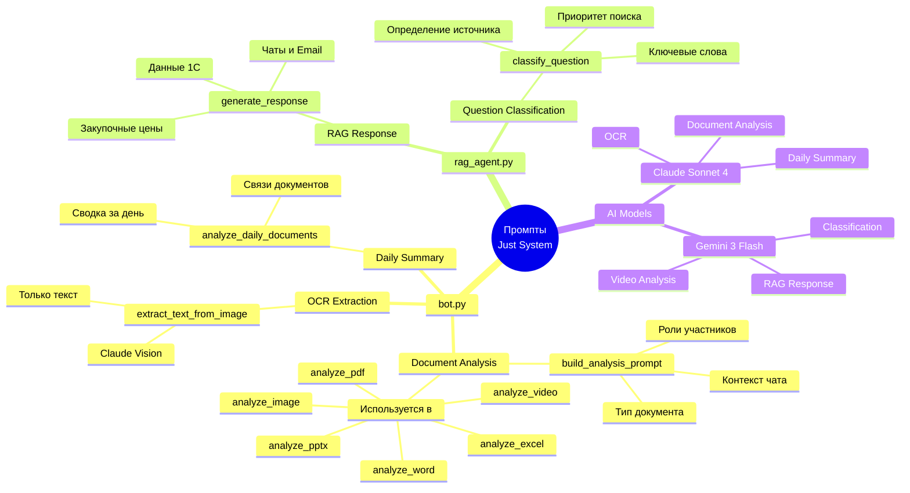
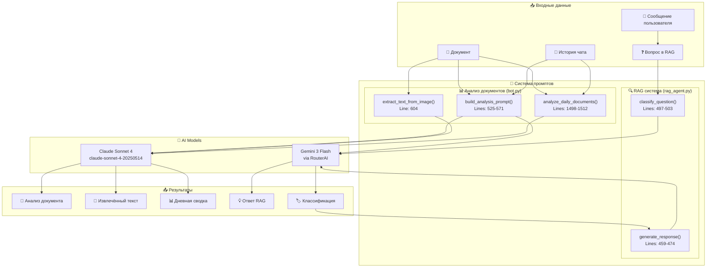
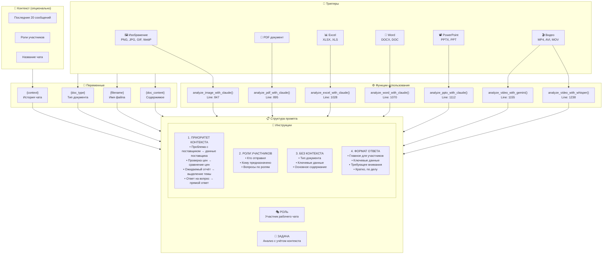
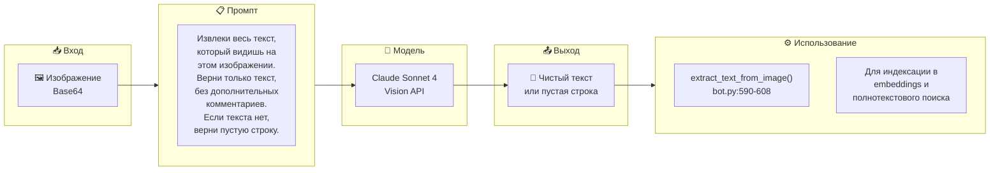
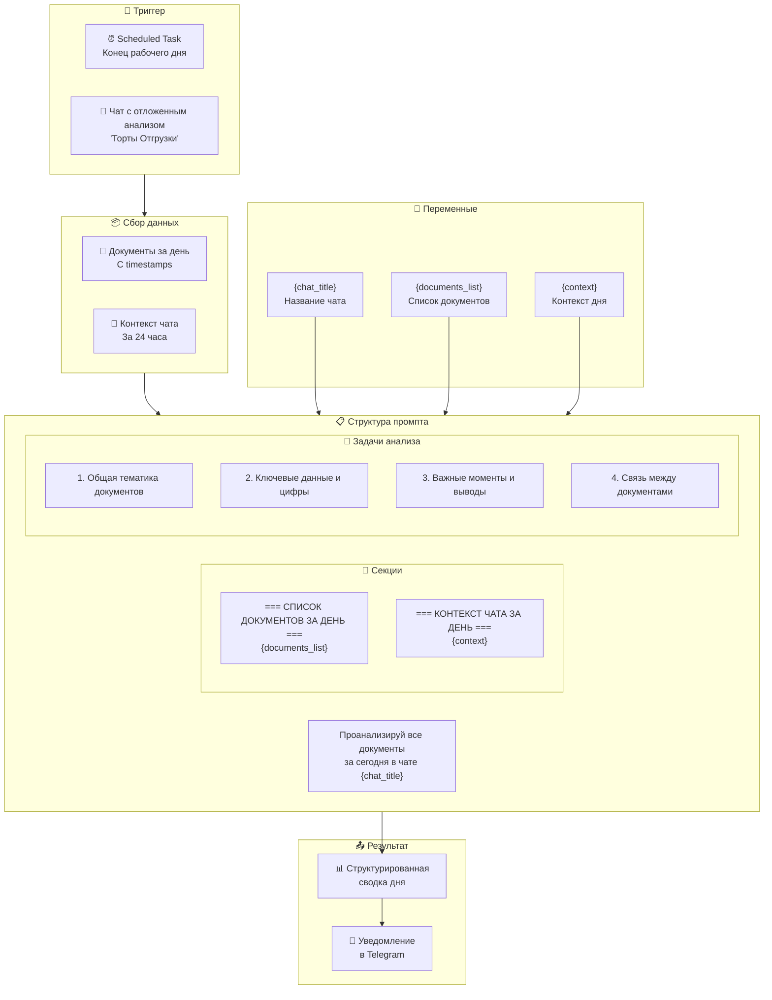
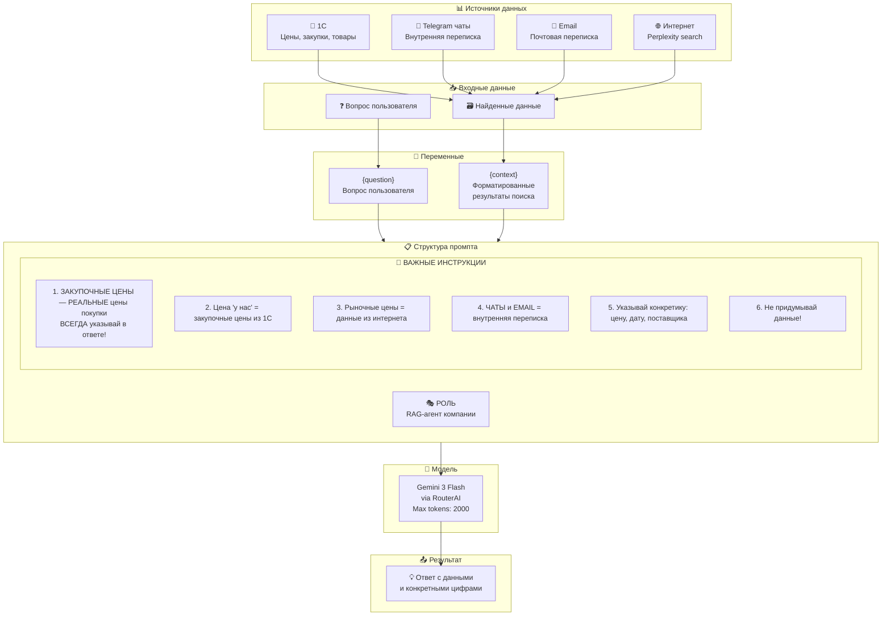
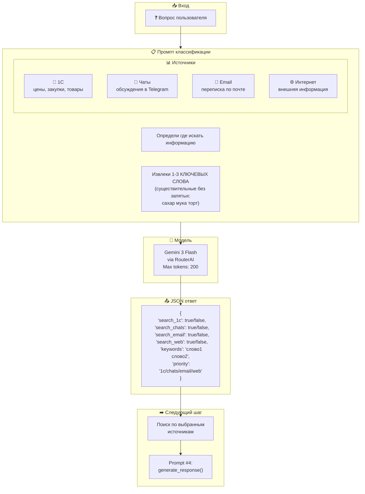
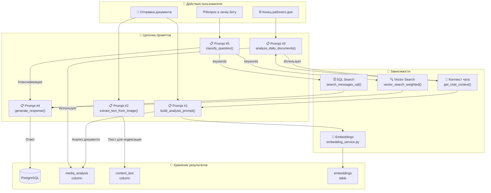
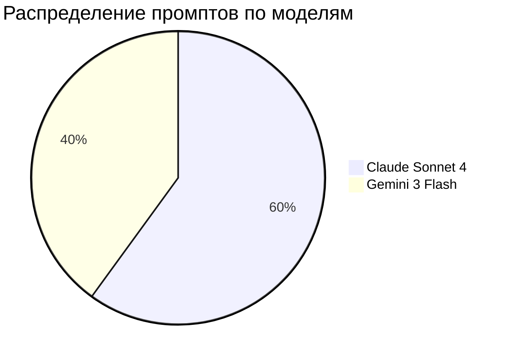
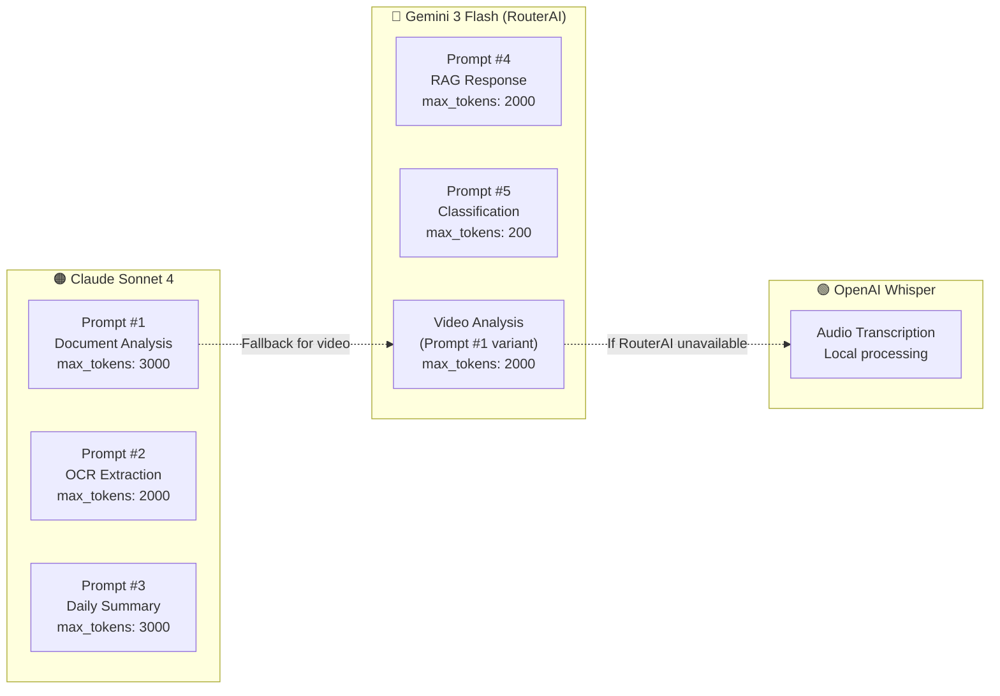

# Prompts Mind Map

## Overview: Все промпты системы



## Детальная архитектура промптов



## Prompt #1: Document Analysis (build_analysis_prompt)



### Полный текст промпта #1

```
Ты — участник рабочего чата, который получил документ от коллеги.
Твоя задача — проанализировать документ так, как его воспримут участники чата,
учитывая контекст обсуждения.

{context}

=== ПОЛУЧЕННЫЙ ДОКУМЕНТ ===
Тип: {doc_type}
Файл: {filename}
{doc_content}

=== ИНСТРУКЦИИ ПО АНАЛИЗУ ===

1. ПРИОРИТЕТ КОНТЕКСТА (ВАЖНО!):
   Если из истории чата понятно, зачем был отправлен этот документ —
   анализируй его ИМЕННО в этом контексте:
   - Если обсуждали проблему с поставщиком → фокусируйся на данных этого поставщика
   - Если просили проверить цены → сравни с тем, что обсуждалось
   - Если ждали отчёт по конкретной теме → выдели именно эту информацию
   - Если документ — ответ на вопрос → дай ответ на этот вопрос

2. УЧИТЫВАЙ РОЛИ УЧАСТНИКОВ:
   - Кто отправил документ и какая у него роль
   - Кому предназначен документ
   - Какие вопросы могут возникнуть у участников с разными ролями

3. ЕСЛИ КОНТЕКСТ НЕ ЯСЕН:
   Только тогда делай стандартный анализ:
   - Тип документа
   - Ключевые данные (даты, суммы, контрагенты, товары)
   - Основное содержание

4. ФОРМАТ ОТВЕТА:
   - Начни с главного: что этот документ значит для участников чата
   - Выдели ключевые данные в контексте обсуждения
   - Укажи, если что-то требует внимания или действий
   - Кратко, по делу, без воды

Проанализируй документ:
```

---

## Prompt #2: OCR Text Extraction



### Полный текст промпта #2

```
Извлеки весь текст, который видишь на этом изображении.
Верни только текст, без дополнительных комментариев.
Если текста нет, верни пустую строку.
```

---

## Prompt #3: Daily Documents Summary



### Полный текст промпта #3

```
Проанализируй все документы, отправленные в чат "{chat_title}" за сегодня.

=== СПИСОК ДОКУМЕНТОВ ЗА ДЕНЬ ===
{documents_list}

=== КОНТЕКСТ ЧАТА ЗА ДЕНЬ ===
{context}

Создай краткий сводный анализ всех документов:
1. Общая тематика документов
2. Ключевые данные и цифры
3. Важные моменты и выводы
4. Связь между документами (если есть)

Анализ должен быть структурированным и информативным.
```

---

## Prompt #4: RAG Response Generation



### Полный текст промпта #4

```
Ты — RAG-агент компании. Отвечай на русском.

ВОПРОС: {question}

НАЙДЕННЫЕ ДАННЫЕ:
{context}

ВАЖНЫЕ ИНСТРУКЦИИ:
1. ЗАКУПОЧНЫЕ ЦЕНЫ КОМПАНИИ — это РЕАЛЬНЫЕ цены по которым мы покупаем товар.
   ВСЕГДА указывай их в ответе!
2. Если спрашивают о цене "у нас" — это закупочные цены из 1С
3. Если спрашивают о рыночных ценах — используй данные из интернета
4. Данные из ЧАТОВ и EMAIL — это внутренняя переписка компании
5. Указывай конкретные цифры: цену, дату, поставщика
6. Не придумывай данные

Ответ:
```

---

## Prompt #5: Question Classification



### Полный текст промпта #5

```
Определи где искать информацию.
Источники: 1С (цены, закупки, товары), Чаты (обсуждения в Telegram),
           Email (переписка по почте), Интернет (внешняя информация).
Извлеки 1-3 КЛЮЧЕВЫХ СЛОВА (существительные без запятых: сахар мука торт)

Вопрос: {question}

JSON: {
  "search_1c": true/false,
  "search_chats": true/false,
  "search_email": true/false,
  "search_web": true/false,
  "keywords": "слово1 слово2",
  "priority": "1c/chats/email/web"
}
```

---

## Связи между промптами



---

## Использование AI моделей





---

## Параметры вызова API

| Промпт | Модель | Max Tokens | Temperature | Особенности |
|--------|--------|------------|-------------|-------------|
| #1 Document Analysis | Claude Sonnet 4 | 3000 | default | Vision API для изображений |
| #1 (video variant) | Gemini 3 Flash | 2000 | default | Через RouterAI proxy |
| #2 OCR | Claude Sonnet 4 | 2000 | default | Vision API |
| #3 Daily Summary | Claude Sonnet 4 | 3000 | default | Batch processing |
| #4 RAG Response | Gemini 3 Flash | 2000 | default | RouterAI endpoint |
| #5 Classification | Gemini 3 Flash | 200 | default | JSON output |

---

## Ключевые особенности промптов

### Общие принципы
1. **Русский язык** — все промпты на русском
2. **Контекстуальность** — учёт истории чата и ролей
3. **Конкретность** — акцент на цифрах, датах, поставщиках
4. **Структурированность** — чёткие инструкции по формату ответа

### Специфика по областям

| Область | Ключевой фокус |
|---------|----------------|
| Документы | Контекст обсуждения → релевантный анализ |
| OCR | Только текст, без комментариев |
| Дневная сводка | Связи между документами |
| RAG | Закупочные цены = приоритет |
| Классификация | JSON формат, ключевые слова |

---

## Файлы и строки кода

| Промпт | Файл | Строки | Функция |
|--------|------|--------|---------|
| #1 | bot.py | 525-571 | `build_analysis_prompt()` |
| #2 | bot.py | 604 | `extract_text_from_image()` |
| #3 | bot.py | 1498-1512 | `analyze_daily_documents()` |
| #4 | rag_agent.py | 459-474 | `generate_response()` |
| #5 | rag_agent.py | 497-503 | `classify_question()` |
